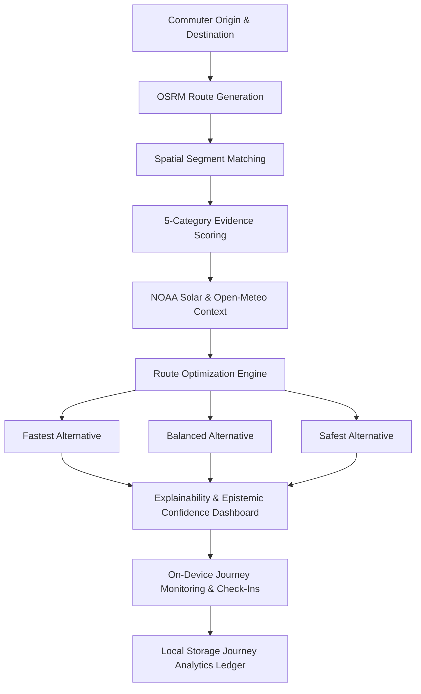

# SURAKSHA PATH (सुरक्षा पथ)

> **Evidence-Based, Context-Aware Safe Route Navigation Prototype for Chennai, India**  
> *Final Project Handover & Production-Ready Prototype — Phase 19*

[](https://www.python.org/)
[](https://fastapi.tiangolo.com/)
[](https://react.dev/)
[](https://leafletjs.com/)
[]()
[]()

---

## 1. Project Purpose & Problem Statement

Urban navigation platforms today optimize almost exclusively for a single objective: **minimal distance** or **minimal travel duration**. In practice, an algorithm optimizing for the fastest route will routinely guide pedestrians, cyclists, or nocturnal commuters through dark alleys, deserted underpasses, or unmonitored transit corridors to save two minutes of travel time.

When safety is considered by existing platforms, it is frequently treated as an opaque, proprietary penalty factor or calculated across coarse neighborhood polygons that fail to reflect physical reality: **a 500-meter stretch of a well-lit arterial avenue carries vastly different risk characteristics than an unlit secondary lane in the very same neighborhood.**

**Suraksha Path** introduces an evidence-based, transparent alternative. Centered on the urban corridors of **Chennai, India**, the platform:
1. Evaluates road networks at the discrete **road-segment level** using physical, verifiable infrastructure evidence (illumination, police outposts, footfall density, road classifications).
2. Explicitly decouples **Environmental Safety Score ($15.0 - 95.0$)** from **Epistemic Data Confidence ($10.0 - 100.0\%$)** to prevent data absence from being mistaken for safety.
3. Presents multi-objective trade-offs comparing **Fastest**, **Balanced**, and **Safest** route alternatives with dynamic **"Why This Route?"** explanations.
4. Provides continuous closed-loop feedback, on-device journey monitoring, safety check-in countdowns, in-app emergency tools, and privacy controls.

---

## 2. Core Concepts & Architectural Innovations



1. **Safety is Distinct from Distance:** Routing engines must treat safety as a visible, multi-criteria trade-off, not a hidden heuristic.
2. **Road-Segment Level Risk:** Physical evidence (streetlights, CCTV, footfall, divider barriers) belongs to discrete road links ($50 - 500\text{ m}$), not broad postal code boundaries.
3. **Safety Score vs. Confidence Score Separation:**
   - **Safety Score ($15.0 - 95.0\text{ pts}$):** Physical protective infrastructure index. Capped at $95.0$ because no public street can be guaranteed perfectly safe in all situations. Capped at $15.0$ as a minimum baseline. $50.0$ is the unassessed neutral anchor.
   - **Confidence Score ($10.0 - 100.0\%$):** Independent measure of data density, temporal recency, and source diversity. Absence of reports yields low confidence, **never a false assumption of safety**.
4. **Trust-Weighted Community Intelligence:** Crowd reports undergo temporal exponential decay, independent confirmation tallying, and administrative moderation to prevent vandalism or stale data.
5. **Nocturnal & Meteorological Context:** NOAA solar algorithms calculate real-time twilight phases in Chennai; Open-Meteo evaluates precipitation and flood traction.
6. **Local-First Privacy:** Location sharing is **OFF by default**; personal travel records are stored strictly in the commuter's local browser storage.
7. **Strict Non-Predictive Ethics:** The platform does **not** predict crime, forecast victimization, or profile neighborhoods.

---

## 3. Confirmed Technology Stack

| Layer | Technology | Version | Purpose in Codebase |
| :--- | :--- | :--- | :--- |
| **Frontend Framework** | React + Vite | React 19.2, Vite 8.3 | High-performance cartographic single-page web client |
| **Mapping Engine** | Leaflet | 1.9.4 | Interactive geospatial map, custom vector overlays, dark tiles |
| **Styling & Design** | Vanilla CSS (Design Tokens) | CSS3 / Glassmorphic | Curated HSL dark palette, fluid typography, zero Tailwind dependency |
| **Backend REST API** | Python + FastAPI | Python 3.13, FastAPI 0.139 | Asynchronous, typed RESTful application gateway |
| **ASGI Server** | Uvicorn | 0.51.0 | Fast, standards-compliant asynchronous server |
| **Database & ORM** | SQLite + SQLAlchemy | SQLAlchemy 2.0 | Zero-credential local spatial graph schema |
| **Schema Validation** | Pydantic v2 | 2.13.4 | Strict typed request serialization, input sanitization |
| **Routing Engine** | OSRM + Public API | Project-OSRM v5 | Pathfinding over authentic OpenStreetMap geometries |
| **Environmental Telemetry**| NOAA Algorithm + Open-Meteo | Public REST | Solar elevation, twilight phases, and real-time precipitation |
| **Automated Testing** | Pytest + Node Test Runner | Pytest 9.1, Node 24 | **227 total automated unit, integration, and E2E tests** |
| **Code Quality** | Oxlint | 1.81.0 | Fast JavaScript linting (0 errors) |

---

## 4. Repository Structure

```text
suraksha-path/
├── .env.example                     # Environment configuration template
├── .gitignore                       # Git exclusion rules (secrets, caches, local DBs)
├── package.json                     # Root script runner for unified execution
├── README.md                        # Primary project documentation & handover
├── backend/
│   ├── conftest.py                  # Pytest path resolution configuration
│   ├── requirements.txt             # Python dependencies
│   ├── app/
│   │   ├── config.py                # Pydantic settings & environment defaults
│   │   ├── database.py              # SQLite session management & schema migrations
│   │   ├── main.py                  # FastAPI entry, lifespan events, security middlewares
│   │   ├── api/
│   │   │   ├── health.py            # GET /api/health probe
│   │   │   └── routes.py            # Centralized API gateway routes
│   │   ├── core/
│   │   │   └── security.py          # Constant-time auth, rate limiting, sanitization
│   │   ├── data/
│   │   │   ├── chennai_osm_roads.geojson    # 500+ authentic Chennai arterial road links
│   │   │   └── chennai_safety_evidence.json # Baseline physical safety evidence catalog
│   │   ├── models/
│   │   │   └── domain.py            # SQLAlchemy tables (RoadSegment, Evidence, Feedback)
│   │   ├── schemas/                 # Pydantic v2 validation contracts
│   │   └── services/
│   │       ├── routing_service.py   # OSRM pathfinding & offline benchmark corridors
│   │       ├── route_optimization_service.py # Fastest / Balanced / Safest trade-off engine
│   │       ├── risk_service.py      # Micro-level segment safety score engine
│   │       ├── confidence_engine.py # Epistemic data certainty calculation
│   │       ├── explainability_service.py # "Why This Route?" generator
│   │       ├── contextual_service.py# NOAA solar position & Open-Meteo integration
│   │       ├── community_service.py # Trust-weighted crowd reports & moderation
│   │       ├── feedback_service.py  # Continuous closed-loop reassessment & audit logs
│   │       └── journey_service.py   # Monitoring sessions & verified Chennai helplines
│   └── tests/                       # 132 backend unit, integration & E2E tests
├── frontend/
│   ├── package.json                 # Node dependencies & scripts
│   ├── vite.config.js               # Vite bundler configuration
│   ├── src/
│   │   ├── main.jsx                 # Client entry point
│   │   ├── App.jsx                  # Main coordinator & tab router
│   │   ├── index.css                # Visual design system tokens & glassmorphic UI
│   │   ├── api/                     # Centralized API client bindings
│   │   ├── components/
│   │   │   ├── shell/               # Header, navigation sidebar, footer
│   │   │   ├── planner/             # Location inputs, suggestions, preferences drawer
│   │   │   ├── map/                 # InteractiveMap Leaflet workspace & overlays
│   │   │   ├── routing/             # Route alternatives comparison & explainability modal
│   │   │   ├── journey/             # Monitoring workspace, check-in timer, SOS modal
│   │   │   ├── analytics/           # Journey insights dashboard, charts, privacy controls
│   │   │   └── views/               # 7 primary application tab views
│   │   ├── services/
│   │   │   └── journeyStorage.js    # Local-first browser storage & metrics engine
│   │   └── tests/                   # 95 frontend unit, integration & E2E tests
└── docs/                            # In-depth architectural & operational documentation
    ├── architecture.md              # System architecture specification & technical handover
    ├── demo_presenter_guide.md      # Step-by-step live demonstration walkthrough
    ├── e2e_integration_and_uat.md   # Complete UAT report & capability audit
    ├── journey_monitoring_and_sos.md# Monitoring state machine & helpline specifications
    ├── journey_insights_and_preferences.md # Analytics ledger & route preferences
    ├── security_and_production_readiness.md # Security audit & hardening controls
    └── route_explainability_dashboard.md # Explanatory trade-offs & metric definitions
```

---

## 5. Prerequisites & Environment Setup

### Prerequisites
- **Node.js**: v18.0.0+ (tested on v24.x)
- **Python**: v3.10+ (tested on v3.13)
- **Git**: v2.30+

### Step 1: Clone Repository
```bash
git clone https://github.com/kannanvenkatesan0255-wq/SurakSha-Path.git
cd SurakSha-Path
```

### Step 2: Install Dependencies
```bash
# Install frontend packages
cd frontend && npm install && cd ..

# Install backend dependencies
python -m pip install -r backend/requirements.txt
```

### Step 3: Environment Configuration
Copy the sample environment file:
```bash
cp .env.example .env
```
*Note: No third-party API keys are required. The prototype functions out-of-the-box on local zero-credential architecture.*

---

## 6. How to Run the Application

In two separate terminals:

### Terminal 1: Backend API (FastAPI)
```bash
npm run dev:backend
```
*API Base URL:* `http://127.0.0.1:8000/api`  
*Interactive Swagger Documentation:* `http://127.0.0.1:8000/docs`

### Terminal 2: Frontend Web App (React + Vite)
```bash
npm run dev:frontend
```
*Application Client:* `http://localhost:5173`

---

## 7. How to Run Tests and Build

Suraksha Path includes **227 passing automated tests** across the workspace:

```bash
# 1. Run all backend tests (132 tests passing)
npm run test:backend

# 2. Run all frontend tests (95 tests passing)
npm run test:frontend

# 3. Run both test suites concurrently
npm run test

# 4. Run frontend linter (0 errors)
npm run lint:frontend

# 5. Build frontend production bundle (0 errors)
npm run build:frontend
```

---

## 8. Summary of Implemented Capabilities (Phases 1–19)

- **Phase 1–3: Foundation, Cartography & Design System:** Glassmorphic dark design system tokens, responsive shell, Leaflet interactive map with Dark Matter basemaps centered on Chennai CMA.
- **Phase 4–6: Journey Planner & OSRM Engine:** Origin/destination catalog with autocomplete, departure time selector, multi-route pathfinding over real OSM ways.
- **Phase 7–8: Road Segmentation & Segment Risk Engine:** 500+ discrete Chennai road segments ingested from OSM; 5 physical evidence categories with temporal half-life decay.
- **Phase 9: Trust-Weighted Community Intelligence:** Crowd hazard observations (`POOR_LIGHTING`, `ACTIVE_POLICE_PRESENCE`), corroboration tallies, and moderation console.
- **Phase 10–11: Safety–Time Trade-Offs & Route Explainability:** Generation of Fastest, Balanced, and Safest alternatives with dynamic **"Why This Route?"** modal and distinct Epistemic Confidence scoring ($10.0 - 100.0\%$).
- **Phase 12: Continuous Feedback Reassessment:** Closed-loop feedback ingestion, segment delta recalculation, and permanent audit log ledger.
- **Phase 13: Temporal & Environmental Adjustments:** NOAA solar elevation for nocturnal illumination and Open-Meteo precipitation/flooding traction advisories.
- **Phase 14: Journey Monitoring, Check-Ins & SOS Prototype:** Active tracking lifecycle (`NOT_STARTED` -> `ACTIVE` -> `PAUSED` -> `COMPLETED`/`CANCELLED`), periodic check-ins, in-app SOS modal, verified Chennai helplines (`100`, `112`, `1091`, `1913`).
- **Phase 15: Journey Insights, Analytics & Route Preferences:** On-device journey history ledger, strict exclusion of cancelled trips from distance metrics, 7d/30d filters, preference sliders, and address masking.
- **Phase 17: Security Hardening & Privacy:** Constant-time key comparison (`secrets.compare_digest`), Bearer auth, self-moderation prevention, HTTP security headers, 1MB body limit, rate limiting.
- **Phase 18: End-to-End Integration & UAT:** Comprehensive E2E test suites covering Flows A through H, bug fixing, and cross-component stabilization.
- **Phase 19: Final Polish, Demo Readiness & Project Handover:** Live demo presenter guide (`docs/demo_presenter_guide.md`), architectural technical handover, and final status reporting.

---

## 9. Live Demo Walkthrough (5-Minute Tour)

1. **Home Tab:** Open `http://localhost:5173`. Review the core thesis ("Why Safety ≠ Distance") and click the preset **"Central to T. Nagar Arterial"**.
2. **Plan Route Tab:** Click **"Calculate Safe Route Alternatives"**. Observe the three route cards (**Fastest**, **Balanced**, **Safest**) and the highlighted polyline on the Leaflet map.
3. **Explainability:** On the **Safest** card, click **"Why This Route?"**. Review the separate Safety Score vs. Epistemic Confidence, category breakdown bars, and nocturnal lighting advisory.
4. **Journey Monitoring:** Click **"Start Journey Monitoring with this Route"**. The journey activates with an active elapsed timer. Test clicking **"I'm OK - Check In"** to acknowledge safety.
5. **In-App SOS:** Click the red **"SOS Emergency"** button. Review verified Chennai emergency numbers (`100`, `112`, `1091`, `1913`). Click **"Dismiss / False Alarm"**.
6. **Journey Completion:** Click **"Complete Journey"**.
7. **Insights & Analytics:** Navigate to the **Insights** tab. View the newly completed trip in the ledger. Check **"Include Chennai Demo Sample"** to demonstrate histograms and 30-day filters. Click **"Clear History"** to demonstrate instant on-device privacy purging.

*(For detailed presenter talking points and failure recovery procedures, see [`docs/demo_presenter_guide.md`](file:///c:/Users/gv519/Documents/SurakSha%20Path%20!/docs/demo_presenter_guide.md)).*

---

## 10. Data Provenance & Real vs. Simulated Boundaries

| Subsystem | Real Data | Simulated / Prototype Data |
| :--- | :--- | :--- |
| **Road Network** | 500+ OpenStreetMap ways in Chennai CMA | — |
| **Route Pathfinding** | OSRM live routing server | Offline benchmark corridor fallback |
| **Sunlight & Solar Phase** | True NOAA solar position calculation for IST | — |
| **Weather & Flooding** | Live Open-Meteo meteorological feed | — |
| **Emergency Helplines** | Verified official Chennai helpline numbers | — |
| **Safety Evidence Baseline** | — | Curated infrastructure audits for Chennai corridors |
| **Community Observations** | — | Sample crowd reports (`is_synthetic: true`) |
| **Live Commuter GPS** | — | Simulated progression coordinates along route |
| **Emergency Dispatch** | — | Dialable shortcuts only; no automated police dispatch |

---

## 11. Known Limitations & Future Improvements

### Current Prototype Limitations
1. **Traffic Awareness:** Routing calculations utilize static road network geometry and free-flow speed limits via OSRM. Real-time dynamic congestion is not integrated.
2. **Pedestrian Pathways:** The road graph is optimized for arterial and secondary vehicular corridors; informal walking shortcuts and footpaths are currently unmapped.
3. **Emergency Dispatch:** The in-app SOS interface provides quick dialer shortcuts to official Chennai emergency services; it does not automatically transmit telemetry to the Police Control Room.
4. **Advisory Heuristics:** Safety scores reflect observed physical infrastructure (lighting, outposts, footfall) and community reports. They do **not** claim to predict crime or guarantee personal safety.

### Future Roadmap
1. **Offline PWA & Vector Tile Caching:** Service worker offline caching for navigation during network dropouts.
2. **Civic Authority Open Data Integration:** Direct spatial ingestion from the Greater Chennai Corporation (GCC) streetlighting telemetry and flood sensor network.
3. **Collaborative Safe Haven Network:** Verification of 24/7 commercial safe havens (pharmacies, fuel stations, metro stations) along transit corridors.

---

## 12. Verification & Test Metrics Summary

| Verification Check | Target | Actual Result | Status |
| :--- | :--- | :--- | :--- |
| **Backend Unit & Integration Tests** | $> 120$ | **132 passed** | **100% PASSED** |
| **Frontend Unit & Integration Tests** | $> 80$ | **95 passed** | **100% PASSED** |
| **Total Automated Test Count** | $> 200$ | **227 passed** | **100% PASSED** |
| **Frontend Production Build (`vite build`)** | Clean `dist/` | **Passed in 321ms** | **0 errors** |
| **Frontend Linter (`oxlint`)** | 0 errors | **0 errors (76 files)** | **0 errors** |
| **Git Working Tree** | Clean & Verified | **Branch `main`, remote verified** | **CLEAN** |

---

## 13. Project Handover & Contact

- **Repository:** `https://github.com/kannanvenkatesan0255-wq/SurakSha-Path.git`
- **Lead Developer:** Kannan Venkatesan (`kannanvenkatesan0255@gmail.com`)
- **Primary Documentation Index:**
  - Architecture & Technical Handover: [`docs/architecture.md`](file:///c:/Users/gv519/Documents/SurakSha%20Path%20!/docs/architecture.md)
  - Live Demo Presenter Guide: [`docs/demo_presenter_guide.md`](file:///c:/Users/gv519/Documents/SurakSha%20Path%20!/docs/demo_presenter_guide.md)
  - End-to-End Integration & UAT Report: [`docs/e2e_integration_and_uat.md`](file:///c:/Users/gv519/Documents/SurakSha%20Path%20!/docs/e2e_integration_and_uat.md)
