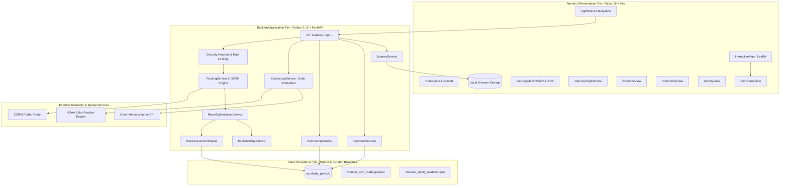

# Suraksha Path: System Architecture Specification & Technical Handover

> **Document Version:** 2.0.0 (Phase 19 Final Product Handover)  
> **Target Domain:** Chennai Metropolitan Area (CMA), Tamil Nadu, India  
> **Status:** Fully Integrated, Stabilized & Verified

---

## 1. System Architecture Overview

Suraksha Path is an evidence-based, context-aware safe route navigation prototype. It implements a decoupled, modern multi-tier geospatial architecture operating on zero-credential local infrastructure:



---

## 2. Component Boundaries & Codebase Directory Map

### 2.1 Frontend Presentation Tier (`frontend/`)

| Subsystem / View | Source File(s) | Primary Responsibility |
| :--- | :--- | :--- |
| **Application Shell** | `src/App.jsx`, `src/components/shell/AppShell.jsx`, `AppHeader.jsx` | Navigation router between 7 primary tabs, live backend telemetry probe, mobile menu. |
| **Design System Tokens** | `src/index.css` | Glassmorphism, semantic colors (`--color-risk-low/medium/high`), accessible typography (Inter & Outfit). |
| **Home & Presets** | `src/components/views/HomeView.jsx` | Core thesis presentation, Chennai landmark quick-start presets (`CHENNAI_PRESETS`). |
| **Route Planner** | `src/components/views/PlanRouteView.jsx`, `src/components/planner/` | Origin/destination inputs, preference drawer, multi-route alternatives generation. |
| **Interactive Map** | `src/components/map/InteractiveMap.jsx`, `MapWorkspace.jsx` | Leaflet cartography, basemap layer switcher (Dark Matter/Voyager/OSM), vector polyline highlighter. |
| **Explainability Dashboard** | `src/components/routing/RouteExplainabilityDashboard.jsx`, `ExplainabilityModal.jsx` | "Why This Route?", Safety Score vs. Epistemic Confidence separation, category breakdown bars. |
| **Journey Monitoring & SOS** | `src/components/views/JourneyMonitorView.jsx`, `JourneyMonitoringWorkspace.jsx` | State machine (`NOT_STARTED` -> `ACTIVE` -> `PAUSED` -> `COMPLETED`/`CANCELLED`), check-in timer, in-app SOS modal. |
| **Journey Insights & Analytics**| `src/components/views/JourneyInsightsView.jsx`, `JourneyInsightsDashboard.jsx` | Completed trip statistics, 7d/30d filters, demo data toggle, address masking, privacy history purge. |
| **Community Intelligence** | `src/components/views/CommunityView.jsx` | Crowd hazard feed, independent confirmation/dispute voting, administrative moderation console. |
| **Continuous Feedback** | `src/components/views/ActivityView.jsx` | Closed-loop road condition reports, model recalibration triggers, audit log ledger. |
| **Local Storage Service** | `src/services/journeyStorage.js` | Zero-telemetry on-device persistence (`localStorage`), corrupted-state auto-healing, metrics computation. |

### 2.2 Backend Application Tier (`backend/app/`)

| Service Module | Source File | Primary Responsibility |
| :--- | :--- | :--- |
| **FastAPI Core Application** | `backend/app/main.py` | Lifespan database/dataset initialization, security middlewares, exception sanitization. |
| **Security & Hardening** | `backend/app/core/security.py` | Constant-time key comparison (`secrets.compare_digest`), rate limiters, payload size checks, XSS filters. |
| **API Endpoints Gateway** | `backend/app/api/routes.py`, `health.py` | Unified route declarations mounted under `/api`. |
| **Routing Engine** | `backend/app/services/routing_service.py` | OSRM integration with resilient offline corridor fallback (`OFFLINE_BENCHMARK_CORRIDORS`). |
| **Route Optimization** | `backend/app/services/route_optimization_service.py`| Multi-criteria evaluation generating **Fastest**, **Balanced**, and **Safest** alternatives. |
| **Segment Risk Engine** | `backend/app/services/risk_service.py` | Evaluates 5 physical evidence categories with temporal half-life decay. |
| **Confidence Engine** | `backend/app/services/confidence_service.py` | Computes epistemic data density, freshness, and multi-source corroboration ($10.0 - 100.0\%$). |
| **Route Explainability** | `backend/app/services/explainability_service.py` | Generates "Why This Route?" narratives, trade-off explanations, and bottleneck segment warnings. |
| **Contextual Service** | `backend/app/services/contextual_service.py` | NOAA solar calculation for nocturnal illumination and Open-Meteo API for real-time weather traction. |
| **Community Intelligence** | `backend/app/services/community_service.py` | Trust-weighted crowd report ingestion, confirmation tallying, duplicate detection, and moderation. |
| **Feedback Reassessment** | `backend/app/services/feedback_service.py` | Controlled closed-loop segment reassessment and immutable audit log logging. |
| **Journey Monitoring Service**| `backend/app/services/journey_service.py` | Server-side journey session validation, verified Chennai helplines catalog, analytics summaries. |

---

## 3. Mathematical Foundations & Metric Definitions

### 3.1 Route Safety Score ($S_{route}$)
Evaluated across assessed segments using distance-weighted averaging:
$$S_{route} = \frac{\sum_{i=1}^{N} (S_i \cdot L_i)}{\sum_{i=1}^{N} L_i}$$
where $S_i \in [15.0, 95.0]$ is the segment safety score and $L_i$ is segment length in meters. An unassessed segment defaults to the neutral baseline anchor of $50.0\text{ pts}$.

### 3.2 Epistemic Confidence Score ($C_{route}$)
Confidence reflects empirical data certainty, **never safety itself**:
$$C_{route} = \min\left(100.0, \, 10.0 + 90.0 \cdot \left[ 0.4 \cdot \text{Coverage} + 0.3 \cdot \text{Recency} + 0.3 \cdot \text{Corroboration} \right]\right)$$
Where:
- $\text{Coverage}$: Percentage of route length backed by recorded evidence streams.
- $\text{Recency}$: Freshness discount computed via exponential half-life decay:
  $$w(t) = 2^{-\frac{\Delta t}{t_{half}}}$$
- $\text{Corroboration}$: Multi-source agreement and community confirmation count.

---

## 4. Technical Handover Guide

### 4.1 Configuration Management
- **Backend Configuration:** Defined in `backend/app/config.py`. All parameters load from environment variables with sensible local defaults:
  - `DATABASE_URL`: `sqlite:///./data/suraksha_path.db`
  - `MODERATOR_KEY`: Administrative key for community moderation.
  - `DEFAULT_CITY`: `"Chennai, India"`
  - `OSRM_BASE_URL`: `"https://router.project-osrm.org"`
- **Frontend Configuration:** Defined in `frontend/src/config/appConfig.js`.

### 4.2 How to Add a New Safety Evidence Source
1. Define the evidence schema in `backend/app/schemas/evidence.py`.
2. Add the stream identifier and weight to `backend/app/services/risk_service.py` under `EVIDENCE_CATEGORY_WEIGHTS`.
3. Provide the baseline dataset in `backend/app/data/` (JSON or GeoJSON format).
4. Register the ingestion logic in `backend/app/services/evidence_service.py`.

### 4.3 How to Run Tests and Validation

```bash
# 1. Full Backend Test Suite (132 tests)
python -m pytest backend/tests -v

# 2. Full Frontend Test Suite (95 tests)
cd frontend && npm test -- --run

# 3. Frontend Linter (0 errors)
cd frontend && npm run lint

# 4. Production Bundle Build (0 errors)
cd frontend && npm run build
```

---

## 5. Ethical Safety Boundaries & Non-Negotiable Rules

1. **No Predictive Crime Forecasting:** Suraksha Path strictly evaluates physical and environmental infrastructure (lighting, outposts, commercial footfall). It does **not** claim to predict crime events, forecast victimization, or profile neighborhoods.
2. **No False Safety Guarantees:** A high Safety Score reflects audited environmental factors, **never a guarantee of personal safety**.
3. **No False Emergency Claims:** In-app SOS provides direct dialable shortcuts to verified Chennai helplines (`100`, `112`, `1091`, `1913`); it does **not** dispatch real police or emergency units.
4. **Transparent Demonstration Labeling:** All synthetic segments, benchmark corridors, and seeded sample records are explicitly labeled with `is_synthetic: true` or `DEMO SEEDED RECORD`.
