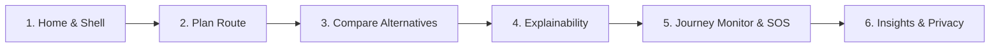

# Suraksha Path: Live Demonstration & Presenter Guide

> **Document Version:** 1.0.0 (Phase 19 Final Handover)  
> **Target Audience:** Presenters, evaluators, and stakeholders  
> **Estimated Demo Duration:** 7–10 minutes  
> **Status:** Verified & Production-Ready Prototype

---

## 1. Demo Setup & Prerequisites

Before starting the presentation, ensure both backend and frontend servers are running:

### Terminal 1: Backend API (FastAPI)
```bash
# From workspace root
uvicorn backend.app.main:app --host 127.0.0.1 --port 8000 --reload
```
*Verify readiness:* Open `http://127.0.0.1:8000/api/health` in your browser. Expected response: `{"status": "healthy", "city_context": "Chennai, India", "database": {"connected": true}}`.

### Terminal 2: Frontend Client (Vite React)
```bash
# In frontend directory
cd frontend
npm run dev
```
*Open application:* Navigate to `http://localhost:5173`.

---

## 2. Step-by-Step Demonstration Walkthrough



### Step 1: Introduction & Urban Context (Home Tab)
- **What to click:** Start on the default **Home** tab (`http://localhost:5173/`).
- **What to say:**
  > *"Suraksha Path is an evidence-based, context-aware safe route navigation prototype focused on Chennai, India. Traditional navigation algorithms minimize travel distance or travel time, often directing pedestrians or commuters down isolated, unlit streets for the sake of a 2-minute shortcut. Suraksha Path treats safety as a first-class, segment-level metric."*
- **What to show:**
  - The top header showing `SURAKSHA PATH`, `CHENNAI`, and the live telemetry pill `API Ready | DB: SQLITE`.
  - The core thesis section: **"Why Safety ≠ Distance"**.
  - The **Demonstration Corridors in Chennai** presets (e.g., *Chennai Central to T. Nagar*, *Guindy to OMR Tidel Park*).
- **Data status:** Real Chennai geographic coordinates and landmark catalog.

---

### Step 2: Route Planning & Alternative Generation (Plan Route Tab)
- **What to click:** Click the preset card **"Central to T. Nagar Arterial"** (or click **"Plan a Route"** in the top navigation).
- **What happens:** The application navigates to the **Plan Route** tab. The origin (`Chennai Central Railway Station`) and destination (`T. Nagar Bus Terminus`) are pre-populated.
- **Action:** Click the primary blue button **"Calculate Safe Route Alternatives"**.
- **What to show:**
  - Loading spinner terminates within 1–2 seconds.
  - Three distinct route alternative cards appear:
    1. **Fastest:** Arterial corridor prioritizing minimal travel time (~11–13 min).
    2. **Balanced:** Pareto-optimal compromise balancing speed and protective lighting (~13–15 min).
    3. **Safest:** Highest composite safety score with maximum verified street illumination and footfall (~15–18 min).
  - Leaflet map renders the active route geometry in cyan/emerald with interactive start/end pins.
- **Data status:** Real OpenStreetMap geometry via OSRM (or offline benchmark fallback if internet is disconnected).

---

### Step 3: Explainability & Epistemic Confidence ("Why This Route?")
- **What to click:** On the **Safest** route card, click **"Why This Route?"**.
- **What to show in the modal:**
  - **Safety Score (15.0–95.0 pts):** Length-weighted environmental infrastructure index based on physical audits (lighting, police booths, dual carriageways).
  - **Epistemic Confidence (10.0–100.0%):** Distinct metric indicating corroboration density and recency.
  - **Category Breakdown Bars:** Relative contributions of 5 core streams:
    - *Street Illumination (35% weight)*
    - *Police Presence (25% weight)*
    - *Pedestrian Infrastructure (20% weight)*
    - *Road Characteristics (10% weight)*
    - *Community Reports (10% weight)*
  - **Nocturnal Advisory Notice:** If departure time is nocturnal (e.g., 21:30), points out illumination gap warnings.
  - **Ethical Disclaimer:** Explicit text stating this is an environmental index, **never a crime prediction or personal safety guarantee**.
- **What to say:**
  > *"Notice that Safety Score and Confidence are strictly separate. An unassessed road is never assumed safe—its absence of evidence yields low confidence, rather than a false sense of security."*

---

### Step 4: Route Preferences Customization
- **What to click:** Click **"Personal Preferences"** in the route planner form.
- **What to show:**
  - Commuter sliders for **Speed vs. Safety Balance** ($0.0 - 1.0$), **Max Detour Tolerance** ($0 - 45\text{ mins}$), and **Avoid Unlit Roads**.
  - Changing weights updates alternative rankings without altering raw segment safety scores.
  - Click **"Reset to Defaults"** to demonstrate instant recovery to baseline balanced parameters.

---

### Step 5: Journey Lifecycle Monitoring & Check-Ins
- **What to click:** On the selected route, click the button **"Start Journey Monitoring with this Route"**.
- **What happens:** The app transitions to the **Journey Monitor** tab (`NAV_TABS.MONITOR`). The journey state initializes to `ACTIVE` with an active elapsed timer.
- **What to show:**
  - Active journey status badge (`ACTIVE`).
  - Scheduled check-in countdown timer (defaults to standard 15-minute intervals, or toggle to 1-minute Demo interval in settings).
  - Click **"Pause Journey"** -> status updates to `PAUSED`.
  - Click **"Resume Journey"** -> status updates to `ACTIVE`.
  - When check-in is due, click **"I'm OK - Check In"** -> check-in confirms and timer resets.
- **Privacy highlight:**
  - Point out that **Location Sharing is strictly OFF by default**.
  - Show the Simulated Demo Progression toggle which advances simulated commuter coordinates along the corridor without accessing real GPS.

---

### Step 6: In-App SOS Prototype & Verified Helplines
- **What to click:** Click the red **"SOS Emergency"** button.
- **What happens:** High-contrast emergency modal opens.
- **What to show:**
  - Direct dialable shortcuts for official Chennai emergency services:
    - Police Emergency: `100` / `112`
    - Women Safety Helpline: `1091`
    - GCC Civic & Flood Grievance: `1913`
    - Ambulance: `108`
  - **Clear disclaimer:** Point out the prominent text stating:
    > *"The Suraksha Path prototype provides dialable shortcuts to official helplines. It does NOT automatically dispatch first responders or track emergency services."*
  - Click **"Dismiss / False Alarm"** to return safely to the active journey.

---

### Step 7: Journey Completion & Local Ledger Archival
- **What to click:** Click **"Complete Journey"**. Confirm the prompt.
- **What happens:** The journey transitions to `COMPLETED`. An event ledger entry is recorded and the trip is archived into local browser storage (`saveJourneyRecord`).

---

### Step 8: Journey Insights, Analytics & Privacy Purge (Insights Tab)
- **What to click:** Navigate to the **Insights** tab (`NAV_TABS.INSIGHTS`).
- **What to show:**
  - The completed journey appears immediately in the **Recent Recorded Journeys** table.
  - **Strict Metric Integrity:** Cumulative completed distance and travel duration reflect strictly completed journeys; cancelled trips are counted in status totals but excluded from distance totals.
  - **Demo Dataset Showcase:** Check the box **"Include Chennai Demo Sample"** in the filter bar.
    - 4 sample Chennai journeys appear with clear yellow badges: `DEMO SEEDED RECORD`.
    - Daily activity charts and the duration distribution histogram render with full sample data.
  - **Privacy Controls:**
    - Toggle **"Mask Addresses"** checkbox: addresses immediately redact door numbers (e.g. `No. 42, 3rd Avenue, Anna Nagar` -> `Anna Nagar area`).
    - Click **"Clear History"** -> confirm modal -> all local journey records are permanently wiped, returning metrics to 0.

---

### Step 9: Trust-Weighted Community Reports & Moderation (Community Tab)
- **What to click:** Navigate to the **Community** tab (`NAV_TABS.COMMUNITY`).
- **What to show:**
  - Verified feed of Chennai observations (`POOR_LIGHTING`, `ACTIVE_POLICE_PRESENCE`, `DESERTED_STRETCH`).
  - Demonstrate independent corroboration by clicking **"Confirm"** on an active report.
  - Moderation console: show how `X-Admin-Key` gates verification and how **self-moderation is blocked** if a contributor attempts to verify their own report.

---

### Step 10: Continuous Feedback Reassessment (Activity Tab)
- **What to click:** Navigate to the **Activity** tab (`NAV_TABS.ACTIVITY`).
- **What to show:**
  - Closed-loop feedback mechanism: civic commuters submit road defect feedback (`INFRASTRUCTURE_ISSUE`).
  - Review the **Reassessment Audit Log** ledger demonstrating that every score delta is permanently tracked with before/after scores and confidence adjustments.

---

## 3. Data Disclosure Matrix: Real vs. Simulated Capabilities

| Feature / Subsystem | Data Provenance | Real vs. Simulated | Presenter Disclosure Statement |
| :--- | :--- | :--- | :--- |
| **Road Network** | OpenStreetMap (OSM) via Overpass API | **Real** | 500+ authentic Chennai arterial road segments with true way IDs and coordinates. |
| **Route Geometry & Time** | OSRM Public API (`router.project-osrm.org`) | **Real** | Real routing pathfinding; offline benchmark corridors used as fallback if network drops. |
| **Solar Illumination** | NOAA Solar Position Algorithm | **Real** | True solar elevation and twilight phases computed dynamically for Chennai (IST). |
| **Weather & Flooding** | Open-Meteo API | **Real** | Live meteorological conditions and precipitation tracking for Chennai coordinates. |
| **Emergency Helplines** | Chennai Police, GCC & ERSS Directory | **Real** | Official verified contact numbers (`100`, `112`, `1091`, `1913`). |
| **Safety Evidence Baseline** | Curated spatial audit dataset | **Simulated / Sample** | Representative infrastructure audits modeled for demonstration corridors. |
| **Community Reports** | Seeded demonstration reports | **Simulated / Sample** | Labeled with `DEMO SEEDED RECORD` or `is_synthetic: true`. |
| **Live Commuter Movement** | Demo progress coordinator | **Simulated** | Interpolates coordinates along route for testing; does not spy on real user GPS. |
| **Emergency Dispatch** | In-app prototype interface | **Simulated** | Dialable phone shortcuts only; no automated police/ambulance dispatch. |

---

## 4. Failure Recovery & Troubleshooting Procedures

| Scenario | Observable Symptom | Immediate Recovery Step |
| :--- | :--- | :--- |
| **Internet Disconnected during Routing** | Route calculation takes longer than 3 seconds | The backend automatically catches the timeout and serves the verified offline benchmark route for Chennai Central to T. Nagar. No manual action needed. |
| **Corrupted Browser Storage** | Malformed JSON error or stale journey session | Click **"Clear History"** in the Insights tab or open DevTools -> Application -> Local Storage -> Clear. Application auto-heals with default state. |
| **Backend API Unreachable** | Header shows red `API Offline` pill | Verify Uvicorn terminal is running on port 8000. Click the **"🔄 Retry"** button in the header once restored. |
| **Accidental In-App SOS Trigger** | Red emergency modal stays open | Click **"Dismiss / False Alarm"** button at the bottom of the modal. No external alert was sent. |

---

## 5. Known Limitations to Disclose Upfront

1. **Traffic Congestion:** Routing durations are calculated using free-flow speed limits; live congested transit times (Google/TomTom style) are not integrated in this prototype.
2. **Pedestrian Pathways:** The OSM road graph is focused on vehicular arterial roads and major dual carriageways; informal pedestrian shortcuts and alleyways are currently unmapped.
3. **No Automatic Dispatch:** In-app SOS is an assistive directory and prototype safety beacon, not a direct API bridge into the Chennai Police Control Room.
4. **Advisory Heuristics:** Safety scores reflect observed physical infrastructure (lighting, outposts, footfall) and community reports. They do **not** claim to predict crime or guarantee personal safety.
