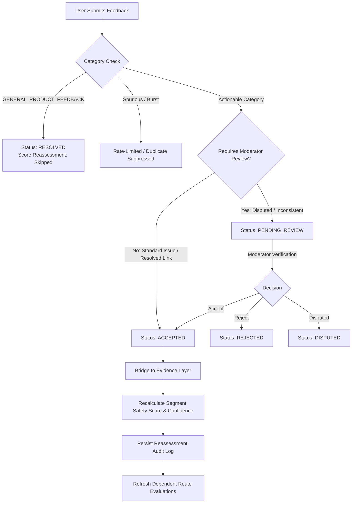

# Feedback-Driven Reassessment & Continuous Improvement (Phase 12)

## 1. Overview & Objectives

Suraksha Path implements a controlled, evidence-based feedback loop allowing commuters, urban researchers, and civic analysts to submit corrections, updates, and observations regarding road segments and routes.

User feedback is treated as **evidence to systematically evaluate**, rather than unvetted ground truth. The system maintains strict separation between **model assessments based on evidence** and **unsubstantiated claims of real-world safety**.

> [!IMPORTANT]
> **Non-Predictive Advisory Boundary**  
> Suraksha Path does not predict crime events, guarantee personal safety, or establish statistical victimization probabilities. A Safety Score change resulting from feedback represents an updated heuristic model assessment based on recorded evidence, not a guarantee that real-world conditions have changed.

---

## 2. Controlled Feedback Taxonomy

Feedback is categorized into controlled, distinct types:

| Feedback Type | Label | Default Intent | Affects Safety Score? | Requires Review? | Operational Action |
| :--- | :--- | :--- | :---: | :---: | :--- |
| `CONDITION_CHANGED` | Road Condition Changed | `CORRECTION` | **Yes** | No | Updates or adds road evidence; triggers immediate segment reassessment if spatially resolved. |
| `OBSERVATION_OUTDATED` | Outdated / Stale Community Observation | `CORRECTION` | **Yes** | No | Expires target community observation or applies freshness decay; recalculates segment score. |
| `REPORT_INACCURATE` | Inaccurate or Duplicate Report | `DISPUTE` | **Yes** | **Yes** | Logs dispute tally against target report, applies dispute suppression, and flags for moderator review. |
| `INFRASTRUCTURE_ISSUE` | Infrastructure or Lighting Defect | `NEW_OBSERVATION` | **Yes** | No | Injects an auditable infrastructure evidence record on the associated segment and updates safety score. |
| `ASSESSMENT_INCONSISTENT` | Assessment Inconsistent with Reality | `DISPUTE` | **Yes** | **Yes** | Queues model assessment dispute for review and recalibrates local data confidence. |
| `LOCATION_ASSOCIATION_ERROR` | Incorrect Location / Mapping | `CORRECTION` | **Yes** | **Yes** | Detaches inaccurate spatial link; recalculates scores for both source and corrected segments. |
| `GENERAL_PRODUCT_FEEDBACK` | General Application Feedback | `GENERAL_FEEDBACK` | **No** | No | Archived for product engineering. **Strictly excluded** from modifying road weights or routing. |

---

## 3. Operational Intents

Commuter submissions declare an operational intent:
- `NEW_OBSERVATION`: A newly identified ground condition not yet captured in municipal or OpenStreetMap layers.
- `CORRECTION`: An auditable update to an existing condition (e.g. broken streetlight repaired).
- `CONFIRMATION`: Independent corroboration of an existing report.
- `DISPUTE`: Contesting the factual accuracy of a displayed hazard.
- `GENERAL_FEEDBACK`: Non-spatial user experience or application feedback.

---

## 4. Feedback Lifecycle & Moderation

### Valid Lifecycle States
1. `SUBMITTED`: Newly ingested into the database.
2. `PENDING_REVIEW`: Awaiting administrative or moderator verification (required for disputes and unverified location mismatches).
3. `ACCEPTED`: Validated and bridged into evidence records; triggers atomic segment reassessment.
4. `REJECTED`: Fails factual validation, contains spam, or is refuted.
5. `DISPUTED`: Contested by independent commuters or under dispute investigation.
6. `RESOLVED`: Inactive historical observation or general product feedback.
7. `EXPIRED`: Time validity window has lapsed.

---

## 5. Controlled Segment Reassessment

When feedback transitions to `ACCEPTED`:
1. **Evidence Store Synchronization**: Creates or adjusts an `EvidenceItem` record on the target segment with an auditable provenance reference (e.g. `Feedback FBK-XXXX`).
2. **Cache Invalidation**: Clears in-memory heuristic assessment caches in `RiskService`.
3. **Atomic Score Recalibration**: Recalculates segment safety score $S \in [15.0, 95.0]$ and confidence $C \in [10.0, 100.0]\%$ using distance-weighted and decayed evidence inputs.
4. **Audit Log Generation**: Persists an immutable `ReassessmentAuditLog` capturing:
   - `trigger_type` (`FEEDBACK_SUBMISSION` or `MODERATOR_REVIEW`)
   - `trigger_reference_id`
   - `previous_safety_score` vs `new_safety_score` ($\Delta S$)
   - `previous_confidence` vs `new_confidence` ($\Delta C$)
   - Timestamp and human-readable explanation summary.

---

## 6. Route-Level Refresh Mechanics

When a segment assessment changes:
- Any active route containing that segment can be re-evaluated via `POST /api/feedback/reassess-route`.
- **Kinematic Invariance**: Route geometry, travel distance, and travel duration are **never modified** by safety reassessments.
- Composite Safety Score, Data Confidence, and Explainability are dynamically refreshed to match the latest segment states.

---

## 7. Abuse Prevention & Privacy Safeguards

- **Rate Limiting**: Maximum 10 submissions per hour per user handle.
- **Idempotency**: Client-supplied `idempotency_key` guarantees duplicate network requests return the same response without duplicate score adjustments.
- **Duplicate Detection**: Identical submissions for the same segment within a 2-hour window are acknowledged idempotently.
- **No Self-Moderation**: A user cannot approve or moderate their own submitted feedback (`PermissionError: Self-moderation prohibited`).
- **Privacy Masking**: Public endpoints and ledgers mask reporter usernames (e.g. `che****er_77` or `usr_****99`).
- **Absence of Evidence**: Corridors with zero reports remain marked as `LIMITED_EVIDENCE` or `INSUFFICIENT_DATA`; the lack of negative reports is never treated as positive safety.
